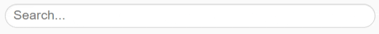

 [](https://codecov.io/gh/internetarchive/iaux-clearable-text-input)

# `<ia-clearable-text-input>` web component

A lightweight web component to display a text input field with a button to clear it, visible only when the field contains text.

[Live demo](https://internetarchive.github.io/iaux-clearable-text-input/main/demo/)



## Usage example

```ts
html`<clearable-text-input
  .value=${'Input value'}
  .placeholder=${'Input placeholder'}
  .screenReaderLabel=${'Enter a value'}
  .clearButtonScreenReaderLabel=${'Clear input field'}
  @clear=${(e: CustomEvent<string>) => console.log(`Value before clear was ${e.detail}`)}
/>`
```

## Other properties
- By default, the input field is focused after being cleared. If this is undesirable, set `.focusOnClear=${false}` to disable.
- If the input field has other external controls, set `.ariaControls=${'controls_id'}` with the DOM ID of the controls element.

## Styling the component
The following style vars are available to modify the appearance of the component:

**Text input field:**
```
  /* Primary */
  var(--input-padding, 0 1rem);
  var(--input-border-width, 1px);
  var(--input-border-style, solid);
  var(--input-border-color, #ccc);
  var(--input-border-radius, 2rem);
  var(--input-color, #555);
  var(--input-font-size, 1.7rem);
  var(--input-line-height, 1.5);
  var(--input-box-shadow, inset 0 1px 1px rgba(0, 0, 0, 0.075));

  /* Focused */
  var(--input-focused-border-color, #66afe9);
  var(--input-focused-box-shadow, inset 0 1px 1px rgb(0 0 0 / 8%), 0 0 8px rgb(102 175 233 / 60%));
```

**Clear button**
```
  var(--clear-button-height, var(--input-height));
  var(--clear-button-width, var(--input-height));
  var(--clear-button-padding, 0);
  var(--clear-button-border, 0);
  var(--clear-button-background-image, <the default close-circle-dark svg>);
  var(--clear-button-background-position, center);
  var(--clear-button-background-size, 75%);
  var(--clear-button-background-repeat, no-repeat);
  var(--clear-button-background-color, transparent);
```

## Local Demo with `web-dev-server`
```bash
yarn start
```
To run a local development server that serves the basic demo located in `demo/index.html`

## Testing with Web Test Runner
To run the suite of Web Test Runner tests, run
```bash
yarn run test
```

To run the tests in watch mode (for &lt;abbr title=&#34;test driven development&#34;&gt;TDD&lt;/abbr&gt;, for example), run

```bash
yarn run test:watch
```

## Linting with ESLint, Prettier, and Types
To scan the project for linting errors, run
```bash
yarn run lint
```

You can lint with ESLint and Prettier individually as well
```bash
yarn run lint:eslint
```
```bash
yarn run lint:prettier
```

To automatically fix many linting errors, run
```bash
yarn run format
```

You can format using ESLint and Prettier individually as well
```bash
yarn run format:eslint
```
```bash
yarn run format:prettier
```
